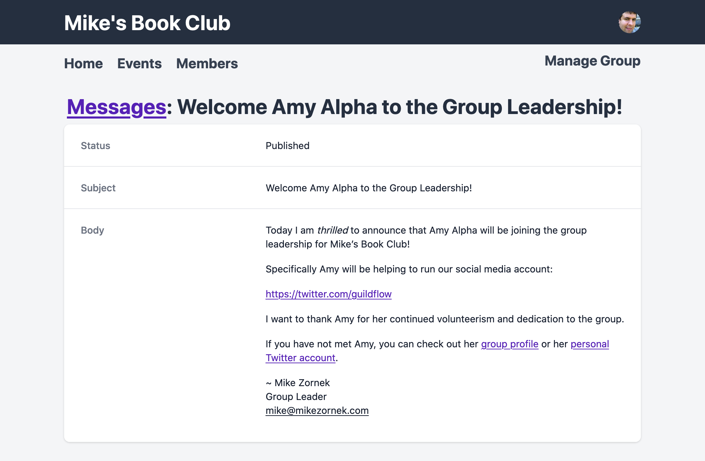
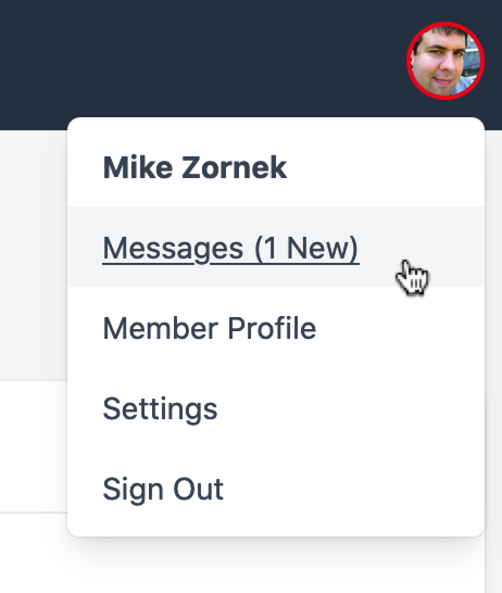
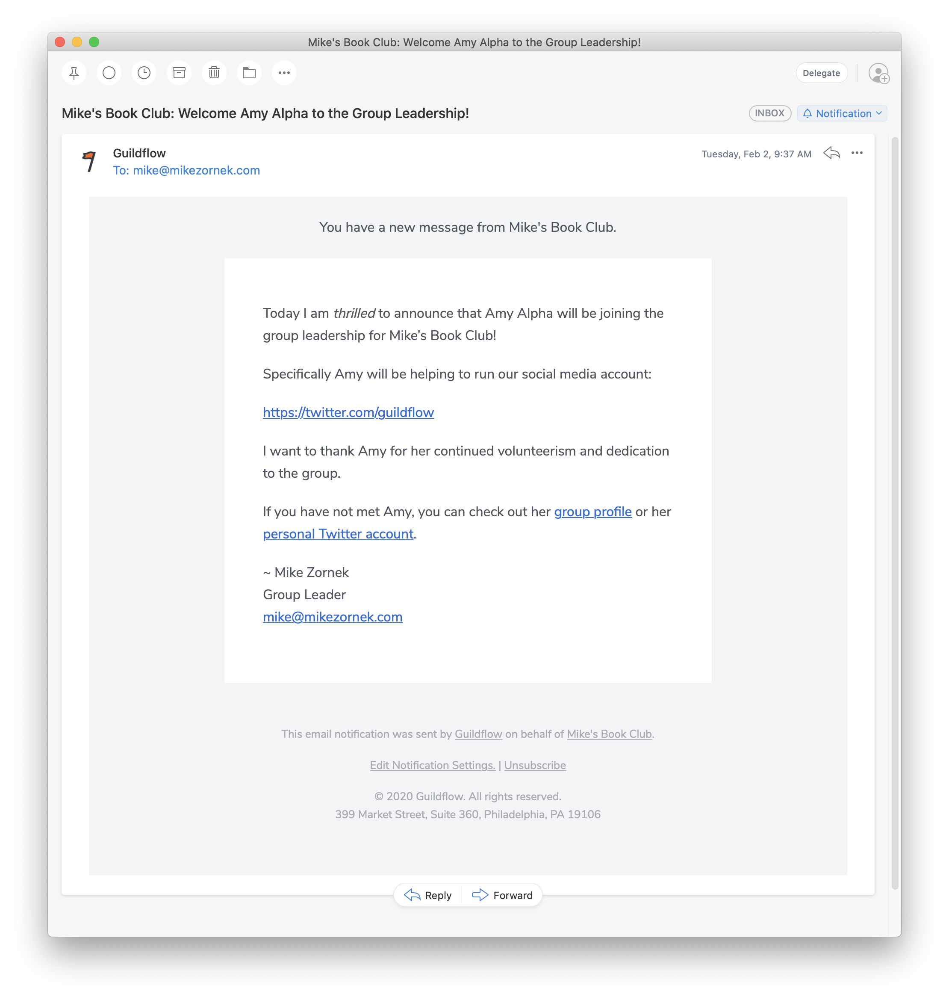



So let's say you want to send a broadcast message to you group about a new member joining the group leadership or to promote an upcoming event. What you'll do is head over to the admin tools inside Manage Group. From there you can browse Messages and click Create Message.

Here you can define a plain text subject line and a rich Markdown-based body. 

<figure class="mb-4 max-w-md mx-auto">
 
 <figcaption class="text-sm italic">Use Markdown content to craft a message.</figcaption>
</figure>

With the Message saved you can verify your copy and make sure the markdown renders the content as you expect. At this point you can continue to edit the message or ask a fellow admin for a second set of eyes. 

Once you are satisfied with the message you'll click Publish and at that moment the Message will be sent to the entire group membership.

<figure class="mb-4 max-w-md mx-auto">
 
 <figcaption class="text-sm italic">After reviewing your edits, publish with a single click.</figcaption>
</figure>

As a member you may now notice a red ring around your avatar. This is a signal that an unread message is awaiting your attention. From here you can click the specific message or mark all messages as read from the main list.

<figure class="mb-4 max-w-md mx-auto">
 
 <figcaption class="text-sm italic">Members can read messages in-app or email.</figcaption>
</figure>

In addition to this in-app messaging, there is also, enabled by default, email notifications for these new messages. When enabled, each member will get an email with the full message contents. 

<figure class="mb-4 max-w-md mx-auto">
 
 <figcaption class="text-sm italic">Emails with no tracking and clean HTML.</figcaption>
</figure>

Per our privacy-first mindset, Guildflow does no pixel tracking of these emails, nor do we truncates the messages to force fake website engagement. Your messages are presented in full using clean and unobtrusive HTML.

I hope you enjoy the new messaging and email notification tools. I'd love to know what you think and your ideas for future improvements.

Beta access to Guildflow for your group is currently available. Check out the website for more info.

That's it for today. Thanks again for interest in Guildflow and I'll see you next time.