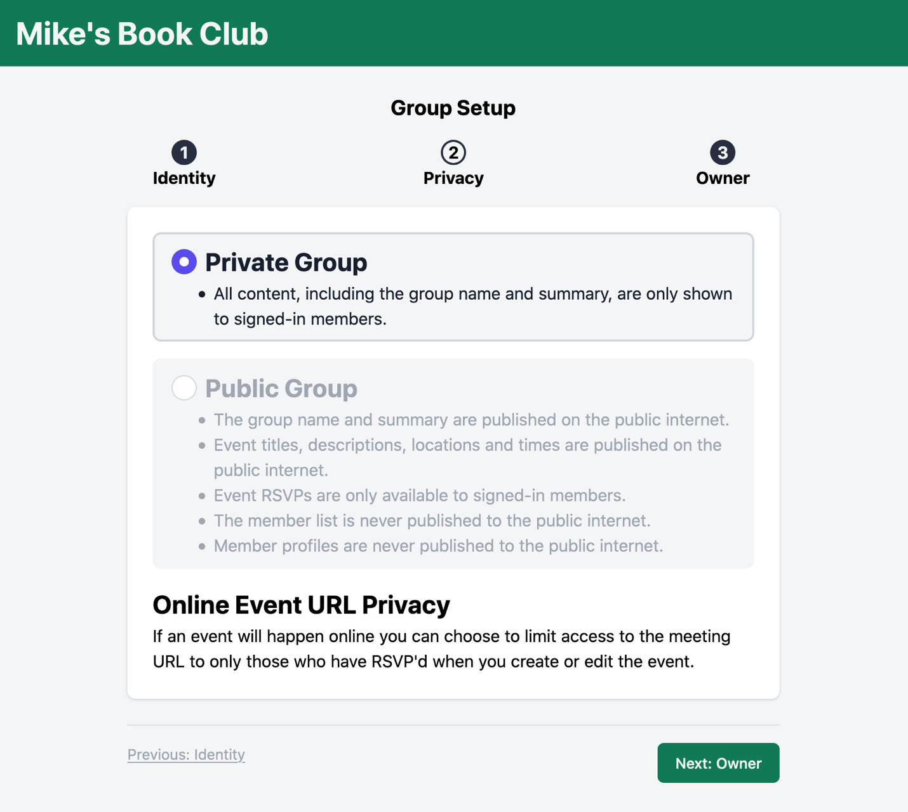
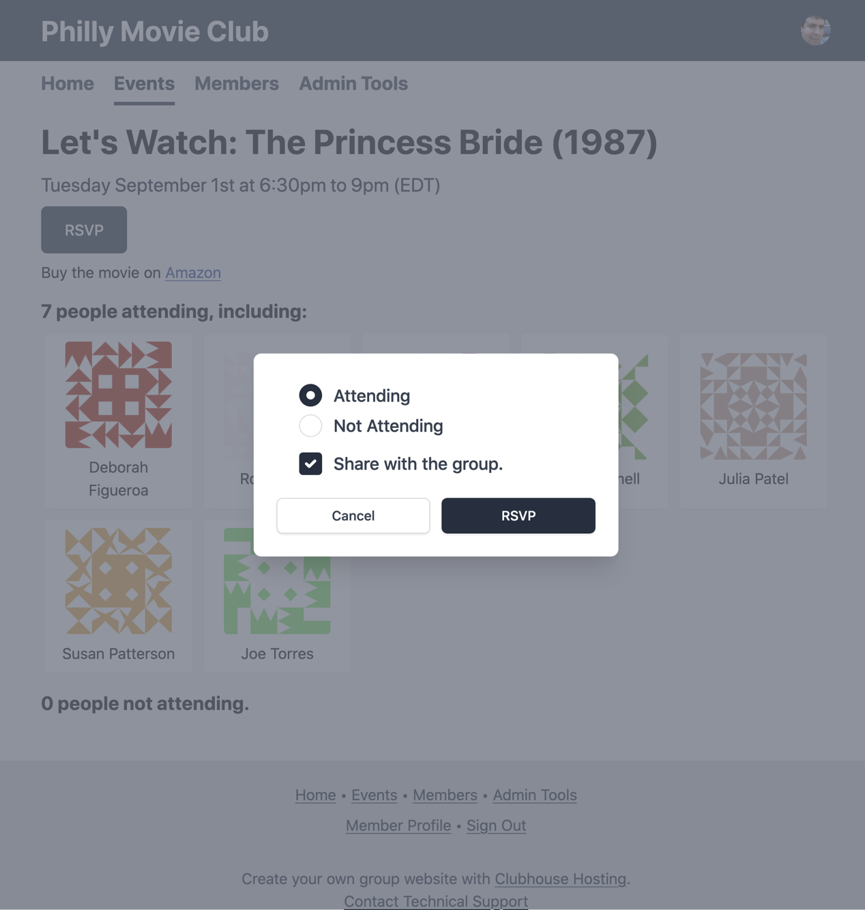

Hi everyone my name is Mike Zornek and I am the developer behind Guildflow.

Guildflow helps group organizers run successful meetup communities. Using Guildflow you can create an online space where members can RSVP to a group event calendar, share profiles information and communicate with each other.

Many popular meetup websites like Meetup.com and Facebook Events lock organizers in with limited access to member data or are powered by an invasive use of member privacy.

Today I want to talk about two ways in which Guildflow is providing professional privacy options that will help your group stand out.

When you create your group in Guildflow you'll have the option to create a Private or Public group. 

<figure class="mb-4 max-w-md mx-auto">
 
 <figcaption class="text-sm italic">Choosing group privacy level during setup.</figcaption>
</figure>

Private groups are strictly locked down, requiring members to sign in for all activity and the group name and summary are never published to the internet at large. This is a great option for groups like a little league baseball team or a substance abuse support group that would benefit from online tools but are not looking to attract new members from random visitors.

Public groups are a bit more open. The name and summary are published as well as basic event info. This is a good option for technical meetups whom are more open to new member discovery and sharing.

Another way Guildflow honors the privacy concerns of members is by requiring consent to publish their name in the member directory or even to a single event RSVP listing. For example, let's say there is an event for finding a new job. Perhaps you don't want your current boss seeing your name listed as attending this kind of event. Maybe you are attending an event on how to hire a divorce attorney and would prefer your attendance doesn't influence some advertising pixel that will in the future serve up suggesting ads all around the web.

<figure class="mb-4 max-w-md mx-auto">
 
 <figcaption class="text-sm italic">An RSVP form offering a consent option for sharing.</figcaption>
</figure>

Organizing a meetup group can be an extremely rewarding endeavor. Please take the time to consider the long term implications about the tools you use to help run that group.

Guildflow is still in development but available as a public alpha. 

We encourage people who would like to hear more about its continued progress to join our [mailing list](/newsletter) or follow our [blog RSS feed](#). You can also follow us on social media at [@guildflow on Twitter](https://twitter.com/guildflow) or [@guildflow on Micro.blog](https://micro.blog/guildflow). 

Thanks for watching and best of luck with your meetup.

Photo by <a href="https://unsplash.com/@mjaleo">Michael Aleo</a>.

