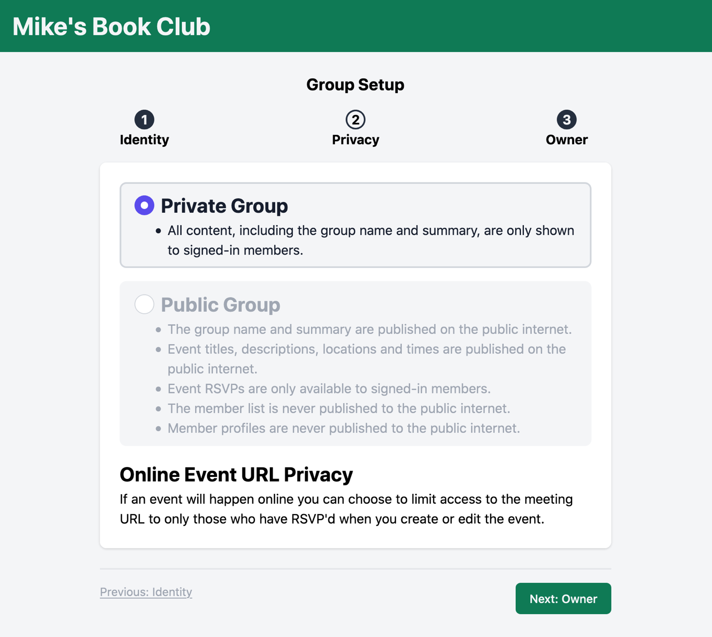

On June 6th I released the latest version of Guildflow. 

It features many improvements, with a major focus on: 

* Drastically expanding the marketing website.
* A new group website template that is more organized and responsive.
* Improved group onboarding.
* Introduction to a privacy level for groups
* Adds a consent checkbox allowing members to choose if they wish to share their RSVP stats within the group.

I want to specifically mention the new privacy level as it has significant implications for the current alpha testers.

If you previously created a group, it has been marked `private`. This means all members will have to sign in to view any aspect of the site. 

To change this to `public` visit the Group Settings in the Admin area, choose `Edit` and then change the `Privacy Level`.

Hope this info helps. [Let me know](mailto:zorn@guildflow.com) if you have any follow up questions.
