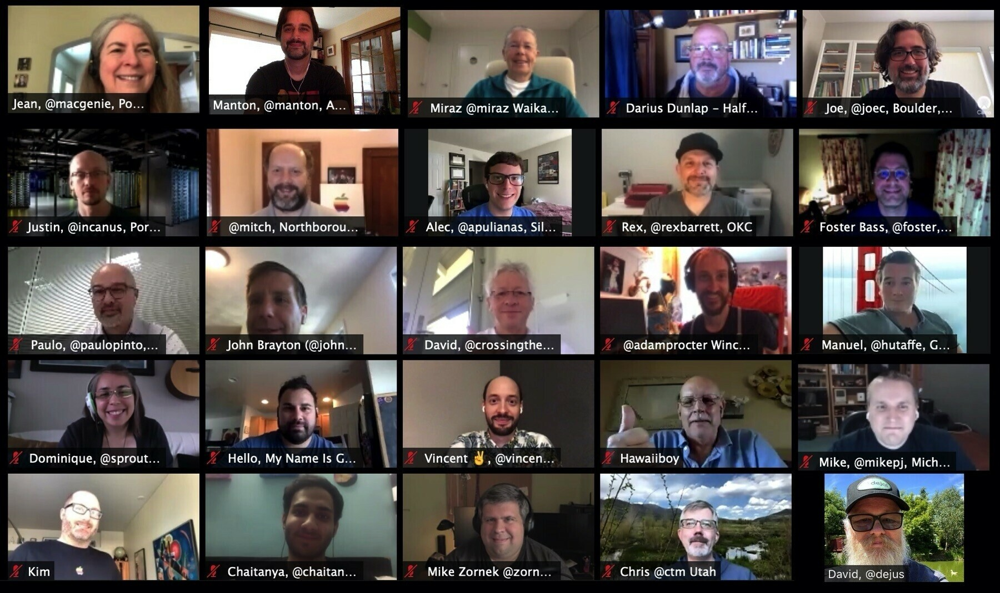

For non-members who are discovering a group for the first time, having a few photos of recent meetings (including group shots and venue shots) on the group website can really help set some expectations and make the group feel more approachable.

During lock down this has not been possible but I wanted to give some props to a few [recent](https://events.indieweb.org/2020/04/online-homebrew-website-club-west-coast-Q8s6bDkwQGlT) [groups](https://micro.welltempered.net/2020/06/23/thanks-to-all.html) I'm a member of who have gone out of there way to do a group screenshot and attach that to the meeting notes.

<figure class="mb-4 max-w-md mx-auto">
 
 <figcaption class="text-sm italic"><a href="https://micro.welltempered.net/2020/06/23/thanks-to-all.html">2020 WWDC Micro.blog group photo.</a></figcaption>
</figure>

In addition to group photos like this, you can consider doing a photo request thread for people to share their home office setup or pets. It's a little thing and usually not very connected the the theme of the group, but in the end we are people and these things help create personal connections. 

Consider a doing a group shot at the beginning of your next online meetup.